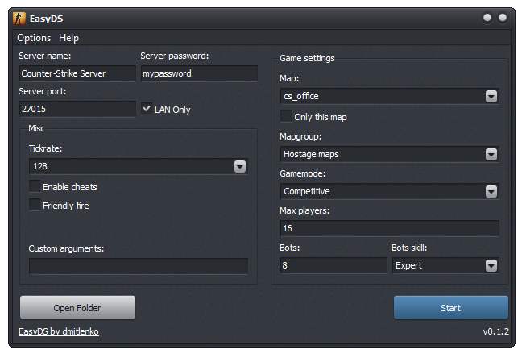

# EasyDS

EasyDS this is GUI version for CS:GO deticated server.

# Installation

1. Download latest release to empty folder.
2. On first start select server folder with srcds.exe.
3. Configure your server.
4. Done!
